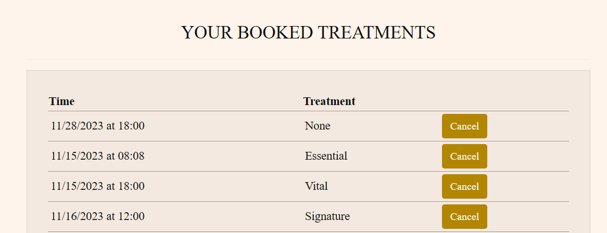

Earth Hammam where you rekindle your soul, treat your body and leave your stress behind in an invigorating wellness and spa experience. The luxury Earth Hammam is a wellness project inspired by the deeply rooted Hammam customs, the North African landscape, the rose-hued buildings of Marrakech and the surrounding Palm plantations and thus the site mirrors that serene warm aesthetic and architecture. Dedicated to personal wellness the site design is serene, minimalistic and timeless ensuring a calming and relaxing user experience. The serene Earth Hammam e-commerce site brings the local Hammam traditions and beauty rituals to the world, inviting visitors from around the world, to book appointments for treatments at the facility, buy their entrance tickets prior to their visit, and buy the signature Earth Hammam products inspired by the scent and atmosphere of this luxury hammam. Furthermore, the exclusive Earth Hammam treatment packages are available to purchase as gift cards making it a perfect gift not only for tourists but also as a corporate incentive. The e-gift cards can be purchased online and redeemed at the facility.

# Table of Contents
## Goals
* Target Users
* Business Model
* Marketing Strategies
* Visual Design
## Features
* Page Elements
* Additional Features
* Features Not Yet Implemented
## Information Architecture
* Database Structure
* Data Models
## Technologies Used
* Languages
* Libraries
* Packages
* Platforms
* Other Tools
## Testing 
* [TESTING.md](/TESTING.md)
* Automated Testing 
* Manual Testing
* Bugs
## Deployment
* Local Deployment
* Heroku Deployment
## Defensive Design
* Session Hijacking
* Delete booking
* User's Order
## Credit
* Media
* Content

# Business Goals

## Target Customer :

The rise of cleansing, detox, wellness and unique rituals has generated billion dollars companies often run by unique individuals seeking adventures, better branding or simply a different lifestyle, thus the Earth Hammam project is designed with B2C business strategies in mind targeting those individuals, tourists, influencers and business travelers who would like to experience or promote unique rituals during their trip to the exotic and mysterious Marrakech. The project is designed to attract individuals and corporations willing to splurge, indulge, be pampered and promote the facility via social media or gift card incentives.
The treatments can be bought in the form of a gift card which makes an ideal corporate incentive targeting corporate individuals as well as influencers. The gift card option incites individuals to go to the facility and spend more benefitting the business.

## Business Model:

A detailed B2C business model can be found [here](https://drive.google.com/file/d/1WhwpEK7BBq7x8GtwCkzAiYOA1SPAY-kx/view?usp=sharing).
Items sold on the site are exclusively curated to attract visitors from abroad, which need prior preparation to enter the facility such as ticketing or booking.
The flexible booking, the five-year redeemable gift card and the tickets are strategies to ensure that the client confident in visiting during this period, is encouraged to buy the tickets and treatments. The signature products are curated to encourage visitors to buy products they used or enjoyed during their visit, prompting the client to spend more on their way out and if they want even from abroad as the site offers wideworld delivery.

**Treatment Gift Card**


The Earth Hammam profits when individuals buy their gift cards online whether for personal use or as a gift. Earth Hammam profits as well when the gift card has not been redeemed. The booking system gives the sense that the gift card can be redeemed whenever the client wants and thus encourages clients to buy gift cards online as long as they have the freedom of booking within the next five years. The five-year gift card flexible plan is for the target customers traveling from afar to come to the facility, this ensures that the client feels confident that they will be able to redeem the gift card on their next travel, even if cancellations happen, the client will buy the gift card. After confirming their order, the client receives their order confirmation email as well as the gift card Email specifying the selected treatment

**Products**


The products sold on the site are inspired by the scent, mood and atmosphere of Earth Hammam, they are sold for returning customers who want to take Earth Hammam home. The client can add the default amount to their bag, adjust the quantity and proceed to check out to purchase the product which includes delivery information and an order confirmation email

**Tickets**


The tickets sold on the site are for returning customers who want to experience Earth Hammam. The client can add the default amount to their bag, adjust the quantity and proceed to check out to purchase the ticket and then receive an order confirmation email. The client can then show their confirmation email at the entrance where they will be given an armband to access the facility

## Marketing Strategies:

1. Social Media Platforms:
The site aims at targeting customers via social media with a Facebook Business Page as well as other social media platforms such as Instagram via the influencers who are invited or visiting the site as well through corporate incentives. The Earth Hammam establishment is an exclusive wellness experience that influencers follow to increase their brand visibility.

2. SEO Techniques used:
- Well-crafted technical SEO to ensure sites are crawled properly.
- Keyword research and use.
- Optimized content.
- SEO-friendly meta tags and titles are placed on each page.
- robots.txt file
- sitemap.xml file

3.  Prioritize Website Speed And Mobile-First Design:
As most customers reach the site via their mobile phones, whether by Google It or via Instagram tags and other platforms, the design of the site prioritizes small screens with responsive design to enhance user experience and behavior increasing the likelihood to purchase the items on the site. Furthermore,  the role that the speed of the page plays in search engine rankings and thus the speed has been rigorously observed and enhanced for better ranking.

4. Email Marketing via Newsletter:
 Email marketing is used to get to those who abandoned their cart, potential customers who signed up for our newsletters from Facebook or the shop, and reach out to existing clients who have not purchased in a while to get them coming back. The newsletter is optimized for front-end formatting to allow better crafting of the newsletter, reaching out to luxury-seeking clients.

5. Blog Postings via Facebook:


The Facebook business page for Earth Hammam is meant to include exclusive offers and a peek into what awaits the new customers as well as reaching out to Facebook users who might know about the facility. The full Facebook page screenshot is [here](https://drive.google.com/file/d/15dDofCW6yGCvrLbS9JmnXTW-W9fffoZN/view?usp=sharing)

6. Referral Marketing via Testimonials and Tags:
The Earth Hammam site includes testimonials from visitors referring the facility to other customers.

7. Privacy Policy for professionalism:
To win the visitors' trust and better SEO ranking, a privacy policy has been added to the footer via a link.

8. Rewards and Certificate of Excellency:
To instill trust and a sense of exclusivity, a link to the certificates has been added to the footer via a link.

9. rel="noopener" on external links:
To improve SEO results and site security, rel="noopener" has been added to all external sites such as partners on the footer or social media links.

## Visual Design:
A folder with further design elements can be accessed [here](https://drive.google.com/file/d/18v09IpZtHExXk-VmWoz7yco60OIh8iU3/view?usp=sharing) as well as the [flowchart](https://drive.google.com/file/d/1kNh8oG1Bea50qopefDBaMDPdYIHumIFM/view?usp=sharing).

### Site Design and Inspiration:


This particular site is dedicated to wellness and relaxation transporting the user to a serene space inspired by the rose-hued architecture and landscape of North Africa. The site has an earthy North African color pallet, aiming at embracing healing, rejuvenation and indulging in a promise of luxury and pampering. The site has a minimal aesthetic and color palette to avoid sensory overstimulation often and offers an intuitive workflow leading to, buying, an entrance ticket, a product or even better a treatment gift card and then if logged in, booking a session and starting a journey of mental repair and pampering. Furthermore, the site contains key information about the facility in the section dedicated to the Hammam, accessible from the navigation, such as a carousel with images inspiring luxurious wellness with unique architecture, authentic ancient healing treatments and beauty rituals. Moreover, a section describing the exclusive offers Earth Hammam provides with links leading the user to shop. Finally, a Testimonial section is added to provide a sense of trust and professionalism.

### Fonts:
The font family and style used are:

   * font-family: 'Montserrat'
   * Lead feature from Bootstrap

### Typography

- [Montserrat](https://fonts.googleapis.com/css2?family=Montserrat:wght@200&display=swap) was used for the primary headers and titles.

- [Font Awesome](https://fontawesome.com) icons were used throughout the site, such as the social media icons in the footer.

- [Hoststar](https://www.hoststar.ch/de) a minimalistic favicon with the word 'Hammam" has been added giving the site a professional look, this was generated using this site.

### Colour Schemes:


 Earth Hammam project is inspired by the rose-hued landscape and architecture of North Africa. The color of limestone, wet sand, olive tree leaves, and desert sand make the tones of the site, installing a sense of peace, relaxation and luxury and ensuring a calm user experience.

 ## Color Reference

| Color             | Hex |
| ----------------- | ----|
| Example Color |#fff4eb |
| Example Color |#4d2d2d |
| Example Color |#d39e00 |
| Example Color | #EBCCAC|

# Features

## Page Elements:
The site contains various pages to introduce the user to the services and offers Earth Hammam has. The following pages are accessible from the extendable navbar on top:


### Welcome page:

A simple and clean welcome page with the Earth Hammam Logo, welcomes the user into the serene world of wellness by Earth Hammam, with an elegant image of a woman being pampered with a massage and a title inviting the customer to "Treat the body and ease the soul" and button leading the user to discover Earth Hammam Marrakech. The button leads to the Hammam section of the site where the overall facility is described.

### Hammam:

1. The first section features the Earth Hammam facility including a brief description of what Earth Hammam stands for, a carousel with images of everything the facility offers such as a hammam, pool, soak tub, aromatherapy treatments and massage rooms. 

2. The next section features exclusive offers at Earth Hammam, such as the treatments, the restaurants and the Earth Hammam signature products with links to draw the user to shop as well as to facilitate navigation.

3. The Testimonials section is displayed as a powerful marketing tool to build trust and inspire professionalism. The testimonials section features only three testimonials to foster esthetic balance and harmony. The admin can update, delete, publish or choose to keep some testimonials saved as drafts for later. This site section is minimal, responsive and centered containing the author of the testimonial and the body of the testimonial. The establishment is then in control of the image they want to portray to clients.


### Earth Hammam Store Categories:

Earth Hammam has three categories of items sold online, Entrance tickets, Treatments Gift Cards and Signature Products. Each category has a page accessible from the navbar and referenced in the hammam page as well. Each category page features items contained in a card with an image, a title, a description, a price and an add-to-bag button. When the user clicks on the add-to-bag button, a default quantity of one is added to the bag. The client can then adjust the quantity on the bag page. The items sold by Earth Hammam type of establishments are very limited in comparison to a large store, and thus the items sold are displayed on one page shortening the buying process for the client, instead of adding a product-detail type page where the client clicks on the product leading to a page with just information about that particular product and only then adds it to the bag. The items have enough information in the description for the client to add them to their cart with fewer clicks.

Once the shopper adds the items to their shopping bag, they can proceed with the payment by filing out proper information, approving and then they will receive a confirmation of their order.

The admin, when logged in as a superuser, will have an extra section to manage Merchandising appearing under the add-to-bag button.


This section allows the admin to delete the item or edit it. If the admin chooses to edit the item, they will be redirected to the Merchandising page, with the item they want to edit information already prefilled, once they undergo the necessary changes, a submit button will then update the information of the item in the proper category. Furthermore, the admin can also simply add another item including an image from the merchandising drop-down menu.

The design of the category pages has a balanced serene and minimalistic aesthetic with an earthy color palette that aims at not overwhelming the shopper with too much information. The design is balanced between a promise of luxury, pampering and relaxation.

The Categories of Items are:

    1. Tickets: The shopper can buy the entrance tickets at the store. featuring two types of tickets, the day ticket and the year ticket allowing visitors to buy their tickets ahead of their visit.
    
    2. Treatments: The shopper can choose to buy the treatments as a gift card, gift it or redeem it for themselves. The gift card is valid for five years giving the shopper enough time to book an appointment using the booking system accessible from the navbar. The business model is to entice the shopper to buy the treatment packages with ease through gift card format appealing to not only individuals but also the corporate industry as an incentive. Whether the gift card has been used or not, Earth Hammam benefits from it. After purchase the shopper will then receive an order confirmation email as well as an elegant e-Gift Card.
 
    3. Products: The shopper often buys spa products at the facility after having experienced the spa and thus the products sold by Earth Hammam target clients that want to take the unique Earth Hammam products to recreate that experience at home.

### Booking:
This section allows the logged-in user to first select a treatment and then book one of the Treatments offered with a handy calendar that shows which days and times are still available and the slots that are not available are grayed out. 

The design of the booking system is coherent with the serene, minimal and earthy tones of the site for seamless user experience. The booking calendar as well as the treatment options are blurred out and non-accessible for non-logged-in users. The message above prompts the users to log in first in order to book a treatment. The blurred overlay is purposely locked for non-logged-in users.

This page is accessible from the navbar for registered or logged-in users. If the user is not logged in or registered the booking features are blurred out and inaccessible.

**Booking Step One**

 - Select a treatment: if the user is logged in and once the user selects a treatment the calendar becomes accessible and no longer blurred out. If the user is not logged in, the booking system is not available and they are prompted to log in to access it.


**Booking Step Two**

- Select a time slot: The user can select only the available times which are not grayed out.


**Booking Submit**

- Selected appointment and submit button: The user's selected time slot is written above the submit button to confirm the appointment before submission and avoid confusion.


**Booked Appointment**

- Booked appointment list: this handy section confirms that the user has booked the appointment by displaying the time and date.
Cancel appointment: the user can also cancel their appointment. Once they click cancel, the data is deleted from the database, making that time slot available again on the calendar.



### Accounts:


 1. **User Account**: the user can log in, log out and access their profile through the right end section of the navbar, login and drop-down menu list profile and logout. The authentification system has been done with the Django-Allauth package.

- Register: New users are prompted to register in order to continue their purchase or book an appointment by filling out a registration form, confirming their account with a confirmation email and then logging in.
- Log in: The flow is standard, provide a username or email and a password, check the *Remember Me* box if the user wants to stay logged in and a *forgot Password* link to reset their password redirecting to the *Password Reset* page, login button to access their account
- My Profile: Allows them to see their profile information, update it and delete their account giving the user CRUD functionality for better usability and the right to privacy. This section also has all their order history.
- Logout: Allows the user to log out by clicking logging out.

 2. **Superuser/Admin Account**: this account is meant for the admin for site management such as merchandising, retailing, client assistance and personal management. The admin managing the site of Earth Hammam has access to a frontend and backend admin page allowing them to perform the following daily tasks:


- Manage Merchandise: the admin can add, edit and delete items sold on the site.


- Newsletter: The admin can send newsletters with a handy email function thanks to a package called "Django-TinyMCE", which allows the admin to format the newsletter content as they wish. 
- Testimonials: The admin can manage testimonials from the backend, publishing, deleting and updating testimonials
- Booked Appointments: The admin can view and edit all the appointments made by the clients, assisting them in managing personal as well as helping clients if assistance is needed
- Orders: The admin is able to see all the orders made by the clients thus they can complete the shipment procedure.
- Manage subscribers: the admin can view and manage subscribers to the newsletter allowing them to manage all marketing aspects as well as further market estimations.

## More features:

### Navigation:


The navbar is centered above the main content of the site where the user can navigate to the Hammam, tickets, treatments,  products or the booking page. The navigation bar also includes a minimalistic yet elegant logo of Earth Hammam written in capitals all black using bootstrap elements 


The responsive navbar collapses for small and medium screens allowing a better user experience and optics.

### Logo: 
Simple clean logo featuring the name of the establishment written in uppercase and bold, placed in the top left corner of the site including the only link that redirects to the welcome page.

### Footer:


The footer includes multiple Social media links for the user to find out more about the establishment. These will open in a new tab. Furthermore, it includes a subscription section allowing the users to receive the newsletter. Underneath the Unsubscribe link, redirect the returning to an unsubscribe page, where the user is prompted to enter their email address and press unsubscribe if they no longer want to receive the newsletter.

The footer includes the following links:

 1. Privacy Policy: redirecting to the establishment privacy policy page

 

 2. Earth Hammam Awards: redirecting the user to the certificates awarded to the facility page

 


 3. Unsubscribe: redirecting the user to the unsubscribe page

 


 4. Address and Contact: redirecting to the page with the contact information and address of the facility

 


 5. Partner Resort: redirecting to an external site that is not sponsored with a ```ref=noopner``` for security measures and SEO ranking. The user can book a stay with the partner.

### Toast Messages:
Various messages notify the user of successful actions, errors and warnings as well as inform the user of the proper steps to take to solve issues.
**Success**: informs the user they have for example successfully added an item to their bag.
**Info**: informs the user that they have for example received a confirmation email validating the last step they have taken.
**Warning**: warns the user if they for example need to fill in the form properly.
**Error**: let the user know that an error has happened for example removing an item from the bag.

### Earth Hammam Custome Emails:


1. Treatment Gift Card Emails: If the shopper has ordered a Treatment Gift Card, an email with the treatment order is generated and sent.
2. Order Confirmation Emails: once an order has been submitted, the user receives an email with the order history.
3. Newsletter Emails: The admin sends an email to all active subscribers.
4. Email Confirmation: with the Django-Allauth package, the user receives an email to confirm account registrations.

### Custom Error Pages:


* 400 Error page appears when the server can not or will not process the request due to something that is perceived to be a client error 
* 403 Error page appears when the user does not have the necessary permissions to access the wanted page
* 404 Error page appears when the server can not find the page requested
* 500 Error page appears when the server encounters a problem, and can not complete a request

## Features Not Yet Implemented

- Post Content:
The admin ability to post articles, meditation guides, journals and workbooks. 

- Book Retreat or a Stay:
Allowing the user to book a stay or a retreat for multiple days with the booking system will be incorporated in the future. At the moment, the user can book a stay at a partner referenced on the footer with a link.

# User Stories:
The following User Stories have all met the acceptance criteria. User Story number 14, will be implemented in the future.
- #1 Read Testimonials: As a User, I can view testimonials so that I can have an impression of the facility and services offered.
- #2 Manage Testimonials: As an Admin I can add, update, publish, draft, and delete testimonials so that I can manage the facility image
- #3 Default Admin Account: As an Admin, I can have a superuser account so that I can manage merchandise, customers, and site settings.
- #4 Register Customer Account: As a user, I can register an account so that I can manage my appointments and paid services
- #5 User Profile: As a User, I can create/read/edit/delete my profile so that I can manage the given information
- #6 Purchasing Products: As a Shopper, I can buy products via the site so that I always have my favorite Earth Hammam products delivered home without going to the spa.
- #7 Booked Services: As an Admin, I can see and reschedule booked services online so that I can manage staff schedules
- #8 Book a Treatment: As a ** Client**, I can book and/or reschedule a treatment appointment online so that I can reserve a spot and manage my appointments
- #9 Purchasing Tickets: As a Shopper, I can buy Thermal Bath Entrance tickets via the site so that I guarantee my entrance before the tickets are sold out.
- #10 Site Admin Page: As an Admin, I can log in to my account from the site so that I can easily add, edit, and delete merchandise to/from the online store.
- #11 View Shopping Cart Items: As a Shopper, I can view the total of items I added to the cart so that I can properly review my total.
- #12 View Purchasable Items: As a Shopper, I can view and read about the different items sold on the site so that I can make an informed purchase.
- #13 Purchase a Treatment Package: As a Shopper, I can buy a voucher for a treatment package on the website so that I can redeem it or gift it.
- #14 Book Overnight Stay Package: As a Shopper, I can book a luxury overnight stay at the EarthHammam VIP Suit so that I can benefit from everything the spa has to offer

# Information Architecture
## Database:

ElephantSQL, hosted by PostgreSQL, has been used as a database. The database is called *earth-hammam*.
The Earth Hammam database diagram is also made available in this [ Drive Folder](https://drive.google.com/drive/folders/1u5UDTR4tyZpV1fQBBKFCroS2t0kUZ7sQ?usp=sharing) 

## Database Diagram:

The below diagram shows the relationship between the different tables in the diagram. PK refers to private keys and FK refers to foreign keys. The tables with a one-to-one relationship are connected with the proper connector. This Entity Relationship (ER) Diagram was done using [moqups.com](moqups.com).


## Data Models:

| **App**     | **Model**   |**Description** |
| -----         | ----------     | -----------------    |
| Home| Testimonial()|has been created and migrated to publish testimonials from the admin panel as a marketing tool|
| Booking| Appointment()| has been created and migrated to book a treatment at the facility as well as manage booked sessions such as canceling a session.|
| Marketing| SubscribedUser()|has been created to allow subscribers to receive the newsletter as well as manage subscription cancelation.|
| Profile|create_or_update_user_profile()| has been created to creqate and update users' profile|
| Products |Category| has been created to categories the items sold on the site into three categories|
| Products |Item| to register the items sold on the site|
| Checkout |Order()| has been created to register the users orders, update orders and set the order number|
| Checkout|OrderLineItem()| has been created to override the original save method to set the lineitem total and update the order total|

# Technologies Used

## Tools & Technologies Used

- [HTML](https://en.wikipedia.org/wiki/HTML) was used for the main site content.
- [CSS](https://en.wikipedia.org/wiki/CSS) was used for the main site design and layout.
- [JavaScript](https://www.javascript.com) was used for user interaction on the site.
- [Python](https://www.python.org) was used as the back-end programming language.
- [Git](https://git-scm.com) was used for version control. (`git add`, `git commit`, `git push`)
- [GitHub](https://github.com) was used for secure online code storage.
- [Gitpod](https://gitpod.io) was used as a cloud-based IDE for development.
- [Bootstrap](https://getbootstrap.com/) was used as the front-end CSS framework for modern responsiveness and pre-built components.
- [ElephantSQL](https://www.elephantsql.com/) was used as the non-relational database.
- [Cloudinary](https://cloudinary.com/) was used to store, transform, optimize, and deliver media assets with APIs.
- [Heroku](https://www.heroku.com) was used for hosting the deployed back-end site.
- [Stripe](https://www.stripe.com) was used to power online payment processing.
- [Canvas](https://balsamiq.com/) was used to create the project wireframes and design.
- [Hoststar](https://www.hoststar.ch/de) was used to generate the favicon used on all pages.
- [coolors](https://coolors.co/) color palette generator was used.
- [moqups.com](moqups.com) was used to design the Entity Relationship (ER) Diagram.

## Testing

For all testing, please refer to the [TESTING.md](/TESTING.md) file.

Code validation was done using the following tools:

| **Tools**     | **Language**   |**Validation Result** |
| -----         | ----------     | -----------------    |
| W3C           | HTML           | Valid                |
| CSS Portal    | CSS            | Valid                |
| https://jshint.com   | Javascript     | Valid                |
| PEP8          | Python         | Valid                |

Responsiveness has been tested using:

  * [BrowserStack](https://www.browserstack.com/)
  * Screenshots of responsiveness have been added to this drive [file](https://www.browserstack.com/).


## Deployment

* Local Deployment

    1. Install Django and supporting libraries mentioned above, create a requirements file, a project and an app, and save, migrate and run the server using the command "python3 manage.py runserver".

* Heroku Deployment:

    1. Create an external database: Create an ElephantSQL account and instance then set up the plan and the instance as instructed and finally add the ElephantSQL database URL to Heroku.
    2. Create the Heroku app: Create the app, add the Config Vars then attach the database.
    3. Prepare the environment and settings.py file: Create a new env.py file, import the Os library, set environment variables including the secret key, add the links to the DATATBASE_URL variable on Heroku and finally add Heroku Hostname to ALLOWED_HOSTS and deploy through Heroku.


## Deployment

The live deployed application can be found deployed on [Heroku](https://earth-hammam-e2008fb66bd6.herokuapp.com/).

### ElephantSQL Database

This project uses [ElephantSQL](https://www.elephantsql.com/) for the Database.

To create a new PostgreSQL database instance this process was followed after account setup:

1. Log in to ElephantSQL.com to access your dashboard
2. Click “Create New Instance”
3. Set up the plan for Earth Hammam
4. Select the Tiny Turtle (Free) plan
5. Select “EU Region”
6. Select EU-West as data center

### Heroku Deployment

This project uses [Heroku](https://www.heroku.com), a platform as a service (PaaS) that enables developers to build, run, and operate applications entirely in the cloud.

Deployment steps are as follows, after account setup:

- Select **New** in the top-right corner of your Heroku Dashboard, and select **Create New App** from the dropdown menu.
- Your app name must be unique, and then choose a region closest to you (EU or USA), and finally, select **Create App**.
- From the new app **Settings**, click **Reveal Config Vars**, and set your environment variables.

| Key | Value |
| --- | --- |
| `DATABASE_URL` | user's own value |
| `SECRET_KEY` | user's own value|
| `CLOUDINARY_URL` | user's own value |
| `CLOUDINARY_CLOUD_NAME` | user's own value |
| `CLOUDINARY_API_KEY` |user's own value |
| `CLOUDINARY_API_SECRET` | user's own value |
| `STRIPE_SECRET_KEY` | user's own value |
| `STRIPE_PUBLIC_KEY` |user's own value |
| `STRIPE_WH_SECRET` | user's own value |

Heroku needs two additional files in order to deploy properly.
- requirements.txt
- Procfile

You can install this project's **requirements** (where applicable) using:
- `pip3 install -r requirements.txt`

If you have your own packages that have been installed, then the requirements file needs updated using:
- `pip3 freeze --local > requirements.txt`

The **Procfile** can be created with the following command:
- `echo web: python app.py > Procfile`
- *replace **app.py** with the name of your primary Flask app name; the one at the root-level*

For Heroku deployment, follow these steps to connect your own GitHub repository to the newly created app:

Either:
- Select **Automatic Deployment** from the Heroku app.

Or:
- In the Terminal/CLI, connect to Heroku using this command: `heroku login -i`
- Set the remote for Heroku: `heroku git:remote -a app_name` (replace *app_name* with your app name)
- After performing the standard Git `add`, `commit`, and `push` to GitHub, you can now type:
	- `git push heroku main`

The project should now be connected and deployed to Heroku!

### Local Deployment

This project can be cloned or forked to make a local copy on your system.

For either method, you will need to install any applicable packages found within the *requirements.txt* file.
- `pip3 install -r requirements.txt`.

You will need to create a new file called `env.py` at the root level and include the same environment variables listed above from the Heroku deployment steps, plus a few extras.

Sample `env.py` file:

```python
import os

# local environment only (do not include these in production/deployment!)

os.environ["DATABASE_URL"] = "user's own value"
os.environ["SECRET_KEY"] = "user's own value"
os.environ["CLOUDINARY_URL"] = "user's own value"
os.environ["CLOUDINARY_CLOUD_NAME"] = "user's own value"
os.environ["CLOUDINARY_API_KEY"] = "user's own value"
os.environ["CLOUDINARY_API_SECRET"] = "user's own value"

os.environ["STRIPE_SECRET_KEY"] = "user's own value"
os.environ["STRIPE_PUBLIC_KEY"] = "user's own value"
os.environ["STRIPE_WH_SECRET"] = "user's own value"
```

## Defensive Design

### Site Access
The purchasing and booking workflows were intentionally designed to be usable and/or visible also by a non-logged-in, anonymous user.

Thereby, an anonymous user can 
* purchase items and complete the entire purchasing workflow.
* view, but not use, the treatment booking page as an incentive to register and book an appointment.
To prevent non-logged-in users from accessing treatment booking controls, while being able to preview them, buttons are disabled in addition to an overlay, which blurs and disables the booking buttons further. Additionally, booking POST requests are only responded to for authenticated users.

### Defense to Session Hijacking
The shopping bag content is handled via the user session. Session hijacking would therefore allow a hacker to modify a user's shopping bag.
Although session hijacking can not be fully guarded against, measures were implemented to defend against it via the following settings:

1) Make the session expire when the browser is closed:

SESSION_COOKIE_SECURE = True

2) Only send the session cookie over an HTTPS connection:

SESSION_COOKIE_HTTPONLY = True

3) Prevent the session cookie from being accessed by JavaScript code:

SESSION_EXPIRE_AT_BROWSER_CLOSE = True

### Booking Defensive Design

1) Protection against manual URL manipulation:

In the booking workflow, a negative offset value (in weeks from current week) can normally not be chosen via the interface. However, it can be entered manually via URL manipulation. The following code protects against manually entering a negative week offset.

        def getOffsetFromRequest(request):
            offset_param = int(request.GET.get('offset', "0"))
            # In case a negative value is given, set back to zero
            # (protection against manual URL manipulation)
            if offset_param < 0:
                offset_param = 0
            return offset_param

2) Only logged-in users who have an Appointment can delete their own appointments:

The following function is used to delete a booking/session. Thereby it is important to ensure,
that only the session owner, meaning the person who booked the session, is able to delete the booking.
Thus, the following code includes parts that ensure only the session owner can delete his own booking. Furthermore, if another user, other than the appointment user, tries to delete an appointment they will be redirected to a code 403 error page.


        @login_required
        def cancel_session(request):
            # This cancels a booking/session
            try:
                # Get the offset parameter from the request
                offset_param = getOffsetFromRequest(request)
                
                # Get session ID
                id = int(request.GET.get('id', "-1"))

                # Get session
                booked_session = get_object_or_404(Appointment, id=id)
                
                # Get user
                user = UserProfile.objects.get(user=request.user)

                # Only the owner can delete the session - updated
                is_same_user = user == booked_session.user

                if (request.method == "GET") and (is_same_user == True):
                    booked_session.delete()
                    return HttpResponseRedirect("/booking?offset=" + str(offset_param))
                raise PermissionDenied

            except Exception as e:
                raise PermissionDenied

* Users Order

Only the owner of the order can view their orders. If the order and the User Profile, don't match the user manipulating the URL will not be granted permission and will be redirected to a 403 Error page. If the user is anonymous, they will be redirected to the login page.

        @login_required
        def checkout_success(request, order_number):
            """
            Handle successful checkouts
            """
            save_info = request.session.get("save_info")
            order = get_object_or_404(Order, order_number=order_number)
            current_bag = bag_contents(request)

            total = float(current_bag["total"])
            grand_total = float(current_bag["grand_total"])
            delivery = float(current_bag["delivery"])

            user_is_logged_in = request.user.is_authenticated

            # Check if user is the same
            user = UserProfile.objects.get(user=request.user)

            is_same_user = user == order.user_profile
            if not is_same_user:
                raise PermissionDenied

            if request.user.is_authenticated:
                profile = UserProfile.objects.get(user=request.user)
                # Attach the user's profile to the order
                order.user_profile = profile
                order.save()

                # Save the user's info
                if save_info:
                    profile_data = {
                        "default_phone_number": order.phone_number,
                        "default_country": order.country,
                        "default_postcode": order.postcode,
                        "default_town_or_city": order.town_or_city,
                        "default_street_address1": order.street_address1,
                        "default_street_address2": order.street_address2,
                        "default_county": order.county,
                    }
                    user_profile_form = UserProfileForm(profile_data, instance=profile)
                    if user_profile_form.is_valid():
                        user_profile_form.save()

                messages.success(
                    request,
                    f"Order successfully processed! \
                    Your order number is {order_number}. A confirmation \
                    email will be sent to {order.email}.",
                )

            if "bag" in request.session:
                del request.session["bag"]

            template = "checkout/checkout_success.html"
            context = {
                "order": order,
                "total_main": total,
                "grand_total_main": grand_total,
                "delivery_main": delivery,
                "user_is_logged_in": user_is_logged_in,
            }

            return render(request, template, context)


## Credit

### Content

| Source | Location | Notes |
| --- | --- | --- |
| [StackOverflow](https://stackoverflow.com/) | feature-details and search-results pages | how to solve various django and stripe issues |
| [Codepen](https://codepen.io/recodenow/pen/YZqgZW) | feature-details page | Five star rating checkbox |
| [StackOverflow](https://stackoverflow.com/questions/37259740/passing-variables-from-flask-to-javascript) | feature-details page | How to pass variable data to JS from the backend |
| [pylessons](https://pylessons.com/django-subscribe) | lessons | Subscribe to Newsletter in Django |
| [Code Institue](https://learn.codeinstitute.net/) | bag- checkout - profile| followed the CI lessons of Boutique Ado to create the bag, checkout and profile lessons |
| [django Documentation](https://docs.djangoproject.com/en/4.2/) | Entire site | code has been created following the Django documentation |
| [Aman](https://www.aman.com/) | Home page | was used for the main site text content and inspiration |
| [Privacy Policy Generator](https://www.privacypolicygenerator.info/) | Privacy Policy | was used to generate a free privacy policy for the site |

### Media

| Source | Location | Type | Notes |
| --- | --- | --- | --- |
| [Wikimedia](https://commons.wikimedia.org/wiki/File:No-Image-Placeholder.svg) | entire site | image | Placeholder image if no poster is found |
| [FlowChart](https://lucid.app/lucidchart/30fddd8a-f5ab-467e-be3b-b210c1bb60cd/edit?viewport_loc=372%2C29%2C1373%2C1547%2C0_0&invitationId=inv_c6d1929d-13d4-4370-8bda-73e9c5664d07) | home page | flowchart | flowchart maker |
| [Miro Board](https://miro.com/app/board/uXjVNcqnHL8=/?share_link_id=999954555341) | home page | Business Model | Business Model maker |
| [Canvas](https://www.canva.com/) | home page | Projects | WEbsite design |


# Further Documentation:

This drive file link leads to all documentation and planning leading to this project.
Project Earth Hammam Drive Folder. [Project Earth Hammam Drive Folder](https://drive.google.com/drive/folders/158YK2I8Abfhij_TjaLuM87yRqbG5rgd9?usp=sharing) 


# Acknowledgment

- I would like to thank my Code Institute mentor, [Rory Patrick Sheridan](https://github.com/Ri-Dearg) for his amazing support throughout the development of this project and studies at CI.
- I would like to thank the [Code Institute](https://codeinstitute.net) tutor team for their assistance with troubleshooting and debugging some project issues.
