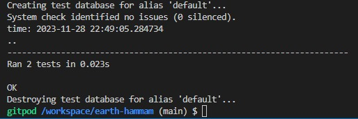
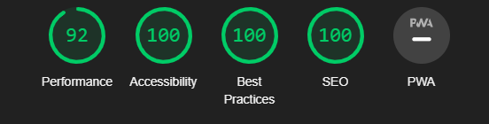

# Testing Protocol:
Testing was conducted automatically as well as manually. Automatic testing was used for backend functions, with an easily testable input-output relationship. Manual testing was added to account for interactive scenarios, that are not easily testable with automation. 

## Automated Testing:
### Why use Automated Unit Testing?
Automated testing was used to efficiently test the core functionality, such as database object creation as well as middleware functionality with a clear input-output relationship. These test cases can then be repeated during the development process, to ensure continuous functionality, thus eliminating human error.

### The features tested with automated unit testing are:
**Database object creation:**
- Booking: Testing of the booking functionality was done, as it contains the creation of all relevant models and functionalities for shop operation. In addition to the actual booking of appointments, this includes the creation of user profiles, shop items as well as orders in the database.
Middleware: Calendar date and session processing functions, which are vital for the correct visualization of the booking calendar.

The results are as follow:

##  Manual Testing:

### Why Use Manual Testing?
Manual testing was conducted for scenarios, that can not easily be tested via automation and thus involve a system-level interaction across several components. Regardless, the manual tests are written in a strictly repeatable manner, to ensure consistency across testers and time.

### The features tested manually are:

1. User registration: Test if the can user enter the required information such as name, email address, password, and address and subsequently register. Test error messages are displayed to the user. 
2. Account management: Test if the user can edit their profile information and view their newly edited saved profile. Test profile deletion and robustness to incorrect entries.
3. Accessibility: Test if the website's features and functions are accessible to users with disabilities, such as screen readers or keyboard-only users.
4. Booking process: Test booking page navigation and session booking, as well as session cancelation.

### Testing Report:

Defensive programming was manually tested with the below user acceptance testing:

| Page | User Action | Expected Result | Pass/Fail | Comments |
| --- | --- | --- | --- | --- |
| **Apppointment Booking**| | | | |
| | book an appointment once registered | appointment booked | Pass | |
| | Select a treatment from the services provided| treatment selected | Pass | |
| | select an available time slot and submit it| appointment selected | Pass |see the booked sessions|
| | cancel a booked appointment| appointment cancelled | Pass | time slot available for booking again|
| **User Registration**| | | | |
| | register a new account  | confirmation email sent | Pass | email confirmed and new user account is visible in the admin|
| | can log in if already registered from the navbar| login successful message | Pass | user logged in|
| | User closes success message| success message closed| Pass | |
| | user can log out if already logged in| redirect to logout page | Pass | click logout and logged out|
| | Enter valid but artificial information into all fields, while using a single-letter password. Click the “register” button| password not strong enough message| Pass | |
| **Edit Profile and Delete Account**| | | | |
| | user can access Profile from navbar  | redirect to profile| Pass | user can see their default information filled in form and order history|
| | user can not edit their profile until they click on the button *Update Information*| Edit profile fields are then allowed | Pass | can edit the fields, update and see edited fields|
| | user can cancel editing| editing cancelled | Pass | |
| | user can delete profile| click on delete  | Pass | user can delete the account after confirming the action- Superuser cannot delete account|
| **Bag**| | | | |
| | user can add any aticket to  bag by clicking add to bag button | default one item added to bag| Pass | success message appears with bag details and go to bag button||
| | User closes success message| success message closed| Pass | |
| | user can add any treatment to  bag by clicking add gift card to bag button | default one item added to bag| Pass | success message appears with bag details and go to bag button||
| | User closes success message| success message closed| Pass | |
| | user can add any product to  bag by clicking add to bag button | default one item added to bag| Pass | success message appears with bag details and go to bag button||
| | User closes success message| success message closed| Pass | |
| | user can click on go to bag from success message | user goes to bag and can see product info, price, quantity, subtotal, grandtotal, delivery charge and secure checkout button| Pass | default one quantity of item present||
| | User closes success message| success message closed| Pass | |
| | user can click on update quantity | quantity updated | Pass | quantity can be updated to more than one - less than one is disabled||
| | user can remove item from list by clicking remove in quantity section | item removed, page reloads to You-bag-is-empty page| Pass | shopper can click on keep shopping and is redirected to Hammam page||
| **Merchandizing**| | | | |
| | accessible from navbar drop-down menu - admin add new ticket to store | fill the form and image| Pass | ticket added to ticket page|
| | accessible from navbar drop-down menu - admin add new treatment to store | fill the form and image| Pass | ticket added to treatment page|
| | accessible from navbar drop-down menu - admin add new product to store | fill the form and image| Pass | product added to ticket page|
| | admin edit an already existing item in store | fill the form and image and submit| Pass | item edited in proper page|
| | admin deletes an already existing item in store | click delete| Pass | delete message appear and item is deleted|
| **Checkout**| | | | |
| | accessible from bag, shopper clicks on *secure checkout*| redirected to checkout| Pass | user can see their order summary and billing information form|
| | Shopper fills Billing information, fields with asterix are compulsory| form is validated| Pass | user can click to correct field|
| | Shopper fills Billing information, fields with asterix are compulsory| form is filled in and payment field changes from visa to mastercard depending on method| Pass | user can click on complete order or go back to bag to adjust bag|
| | Shopper clicks on *adjust bag* | Shopper redirected to bag where they can adjust bag| Pass | user can adjust bag|
| | user clicks on complete order| a spinner appears, page reloads to checkout_success page| Pass | user can see thier order details, a thank-you-for-your-order message|
| | User closes success message| success message closed| Pass | |
| | user redirected to checkout_success| a success message with the order summary and total appears| Pass | the success message remains on the top right corner until user closes it|
| | User closes success message| success message closed| Pass | |
| | user clicks on complete order| a confirmation email is sent to the user| Pass | order confirmation emails entails the order summary and delivery information |
| | user orders a treatment and clicks on complete order| a Treatment Gift Card is sent to the shopper | Pass | user can see thier EGift card with the treatement purchased|
| | shopper clicks on *keep shopping* from checkout_success| user is redirected to the Hammam page| Pass | user can see the Hammam page|
| **Newsletter Subscribtion**| | | | |
| | accessible from the footer, the user enters their name and email to subscribe| A successfully-subscribed message with the email address of the subscriber confirms subscription | Pass | user can see the email they entered for subscription in message|
| | User closes success message| success message closed| Pass | |
| **Unsubscribe**| | | | |
| | accessible from the footer, the user clicks on unsubscribe| user is redirected to unsubscribe page | Pass | user can see a field to enter their email and a button to unsbscribe|
| | user enters their email and clicks on unsubscribe| success message appear informing the user that they have been unsubscribed | Pass | success message contains the email entered to unsubscribe|
| | User closes success message| success message closed| Pass | |
| **Newsletter Admin**| | | | |
| | accessible from the account drop down menu, Superuser can edit newsletter content with editor| Superuser can write and edit the newsletter content with editor| Pass | superuser can see list of subscribers|
| | superuser submits newsletter by clicking send| a success message appears if no error accurs| Pass | superuser can see previous newsletters sent on the admin panel|
| | superuser sent newsletter but error occurs| error mesage appears if newsletter is not sent properly| Pass | |
| **Testimonials**| | | | |
| | Bottom of the Earth hammam page, the user can read the testimonials| Testimonials published by the superuser are visible in three responsive rows| Pass | |
| | Superuser can publish testimonials from default django admin panel| Testimonials are published on the site| Pass | Testimonials, Name of reviewer visible|
| **Privacy Policy**| | | | |
| | Bottom of the footer, the user clicks on the Privacy Policy link| User is redirected to the privacy policy page | Pass | User can return to site using the navigation |
| **Awards**| | | | |
| | Bottom of the footer, the user clicks on the Awards link| User is redirected to the certification page where they can see the certificates of Excellence | Pass | User can see links to the treatments and tickets page|
| | user clicks on the link to tickets| User is redirected to the tickets page | Pass | User can see tickets page|
| | user clicks on the link to treatments| User is redirected to the treatments page | Pass | User can see treatments page|
| **logo**| | | | |
| | click on logo entitled EARTH HAMMAM| User is redirected to home page | Pass | User can see main image and button|
| **Home**| | | | |
| | click on explore Earth Hammam button| User is redirected to Hammam page | Pass | User can see hammam details
|

## Code Validation

### HTML

The recommended [HTML W3C Validator](https://validator.w3.org) was used to validate all the HTML files.
The major errors flags that were deemed unresolvable such as *Bad value  for attribute href on element a: Illegal character in path segment: { is not allowed* are related to django Built-in template tags and other Django template system and thus ignored. Erros steming from HTML were all corrected until pass.

|html file | Errors|Notes|
|---	|---	|---	|
|Footer| no errors| Pass|
|Home Page| no errors | Pass|
|Hammam| no errors | Pass
|Tickets| no errors | Pass|
|Treatments| no errors | Pass|
|Products| no errors | Pass|
|Booking| no errors | Pass|
|Checkout| no errors | Pass|
|Bag| no errors | Pass|
|Checkout success| no errors | Pass|
|log in| no errors | Pass|
|Register| no errors | Pass|
|Logout| no errors | Pass|
|Privacy Policy| no errors | Pass|
|Certification| no errors | Pass|
|Page 404|no errors|Pass|
|Profile|no errors|Pass|
|add_item|no errors|Pass|
|edit_item|no errors|Pass|
|unsubscribe|no errors|Pass|
|newsletter|no errors|Pass|

### CSS

The recommended [CSS Jigsaw Validator](https://jigsaw.w3.org/css-validator) was used to validate all the CSS files.

|css file | Errors|Notes|
|---	|---	|---	|
|base.css| no errors| Pass|
|profiles.css| no errors| Pass|
|checkout.css| no errors| Pass|

### JavaScript

I have used the recommended [JShint Validator](https://jshint.com) to validate all the JS files.

|Js file | Errors|Notes|
|---	|---	|---	|
|countryfield.js| no errors| Pass|
|stripe_elements.js| no errors| Pass|
|booking.js| no errors| Pass|

### Python

The recommended [PEP8 CI Python Linter](https://pep8ci.herokuapp.com) to validate all the Python files.

Error E501 *line too long* flagged by *pycodestle* concerning API addresses, keys and other fragile code lines, have been silenced using *#noqa*, as issues resulting from modifying these lines would result in errors and bugs far more complex than PEP8 regulations would. Thus, I chose to not modify these lines.

|Py Files in App | Errors|Notes|
|---	|---	|---	|
|bag app| no errors| Pass|
|booking| no errors| Pass|
|checkout| no errors| Pass|
|earth_hammam| no errors| Pass|
|home| no errors| Pass|
|marketing| no errors| Pass|
|products| no errors| Pass|
|profile| no errors| Pass|

# Site Lighthouse Score:

## Accessibility

  * The overall performance of the site has been tested on desktop and mobile using Lighthouse and the site has passed the accessibility test

## Best Practices

  * The overall site follows best practices on desktop and mobile using Lighthouse.

## SEO

  * The overall SEO  of the site is following basic search engine optimization advice using lighthouse.

## Performance

 * The overal site perfoamce has been tested using the lighthouse. Page performing under 90 have all been improved. Major performance issues were due to image sizes and thus images have been compressed or resized where necissary.

### Lighthouse score:
Pass: 90 + green score

Fail: ≤ 89 red score

|Page |Accessibility|Best Practices|SEO|Performance|
|---	|---	|---	|---	|---	|
|Welcome Page| Pass |Pass|Pass|Pass|
|Hammam| Pass|Pass|Pass|Pass|
|Products|Pass|Pass|Pass|Pass|
|Treatments|Pass|Pass|Pass|Pass|
|Booking|Pass|Pass|Pass|Pass|
|Bag|Pass|Pass|Pass|Pass|
|Checkout|Pass|Pass|Pass|Pass|
|Checkout success|Pass|Pass|Pass|Pass|
|Register|Pass|Pass|Pass|Pass|
|Log in|Pass|Pass|Pass|Pass|
|Newsletter|Pass|Pass|Pass|Pass|
|Profile|Pass|Pass|Pass|Pass|

## Responsiveness:

This section tests the responsiveness of all page elements displayed on different screen sizes. Furthermore, this test makes sure that the design fully meets the needs of users and is displayed without any problems on any type of device or browser. The layout should automatically adapt to different sizes and capabilities of various devices while taking into account that the user uses not a "click" but a "touch."

The responsiveness has been tested using a testing tool called [BrowserStack](https://www.browserstack.com/) to test the site on dominantly used browsers (screenshots available) and devices.

1. Browsers: 

- Chrome
- Edge
- Safari
- Opera
- Firefox

2. Devices:

- Android
- IOS
- Mac
- Windows

3. Design:

- Contrast
- Image
- Buttons
- Forms
- Navbar
- Icons
- Footer
- Dropdown menu
- Fonts

### Test Assessment:
Pass: meets UX and UI best practices
Fail: needs further adjustments to meet UX and UI best practices

|Page |Small Screen|Medium Screen|Large Screen|
|---	|---	|---	|---	|
|Welcome Page| Pass |Pass|Pass|
|Hammam| Pass|Pass|Pass|
|Products|Pass|Pass|Pass|
|Treatments|Pass|Pass|Pass|
|Booking|Pass|Pass|Pass|
|Bag|Pass|Pass|Pass|
|Checkout|Pass|Pass|Pass|
|Checkout success|Pass|Pass|Pass|
|Register|Pass|Pass|Pass|
|Log in|Pass|Pass|Pass|
|Newsletter|Pass|Pass|Pass|
|Profile|Pass|Pass|Pass|

## Bugs:
1) Issue: The user was able to book a session in the past.
Resolution: The user is now prevented from booking past sessions, by disabling the possible user interaction for the present day and all previous days.

2) Issue: Regardless of the error, the user always received the same "Passwords do not match" error when making a mistake in the registration form.
Resolution: A custom routine was added to the user registration routines to extract the exact error from the available information.

3) Issue: Although for the current week, no "Previous week" button is shown, the user was able to manipulate the URL parameters manually to change the calendar to any previous week.
Resolution: Negative URL parameters for the week offset are now blocked.

4) Issue: Cloudinary has created doubles of all images included in the media file.
